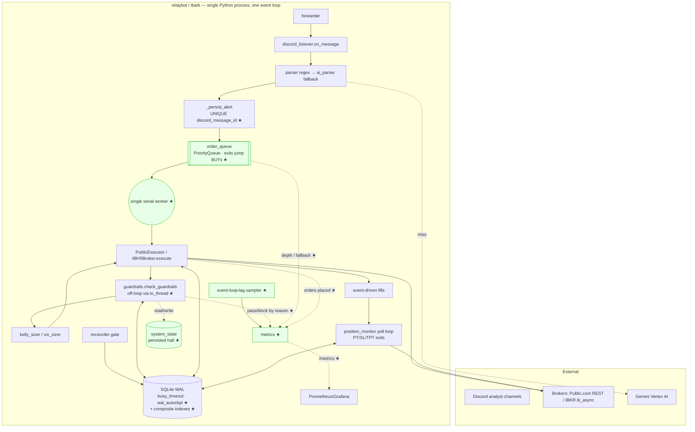
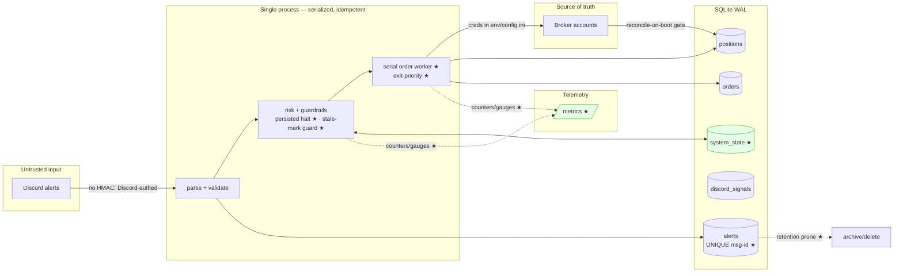

# Architecture Diagrams

Current architecture (single-process monolith, one event loop, one SQLite, one
broker connection — correct for a single account). ★ marks subsystems added in
the 2026-06 reliability hardening pass (see `docs/OBSERVABILITY.md`).

## 1. Architecture diagram



## 2. Sequence diagram (alert → order-ack)

```mermaid
sequenceDiagram
  autonumber
  participant D as Discord
  participant L as Listener
  participant DB as SQLite
  participant Q as order_queue ★
  participant W as serial worker ★
  participant G as guardrails
  participant SS as system_state ★
  participant B as Broker
  participant M as metrics ★

  D->>L: alert (BUY/SELL …)
  L->>L: parse (regex → AI fallback)
  L->>DB: INSERT alert (UNIQUE msg-id) ★
  alt duplicate message
    DB-->>L: IntegrityError → drop ★
    L->>M: alert_dup_rejected_total++
  else new
    L->>M: alerts_received_total++
    L->>Q: dispatch(priority = EXIT if SELL else ENTRY) ★
    Note over Q,W: SELLs drain ahead of BUYs; one job at a time
    Q->>W: dequeue
    W->>G: check_guardrails (to_thread, off loop) ★
    G->>SS: ensure_halt_loaded (restart-safe) ★
    G->>DB: open-count / daily-trades / daily-PnL<br/>(stale-mark haircut ★)
    alt blocked
      G->>M: guardrail_block_total{reason}++ ★
      opt MAX LOSS
        G->>SS: persist halt ★
        G->>M: halt_set_total++ ★
      end
      G-->>W: (False, reason) → no order
    else allowed
      G->>M: guardrail_pass_total++ ★
      W->>B: place_order (orderRef=oid)
      B-->>W: ack PENDING
      W->>DB: INSERT order
      W->>M: orders_placed_total{side}++ ★
      B-->>M: (later) event-driven fill → position
    end
  end
```

## 3. Data flow / trust boundaries



## Notes

- **Single event loop:** listener, position monitor, forwarder, reconciler, and
  the order worker are all `asyncio` tasks — no OS threads except the transient
  `to_thread` the guardrail runs in.
- **Serialized order path:** every order flows through ONE worker draining a
  priority queue, so the guardrail count→insert is effectively atomic (no
  cap-breach race) and exits drain ahead of entries.
- **Source of truth is the broker:** local SQLite is a cache; reconcile-on-boot
  reconciles positions before BUYs are allowed.
- **Open gaps** (not shown, tracked): deterministic broker `orderRef`, durable
  crash-recovery queue, in-flight-order journal, cross-host shared state
  (Postgres). See `docs/OBSERVABILITY.md`.
